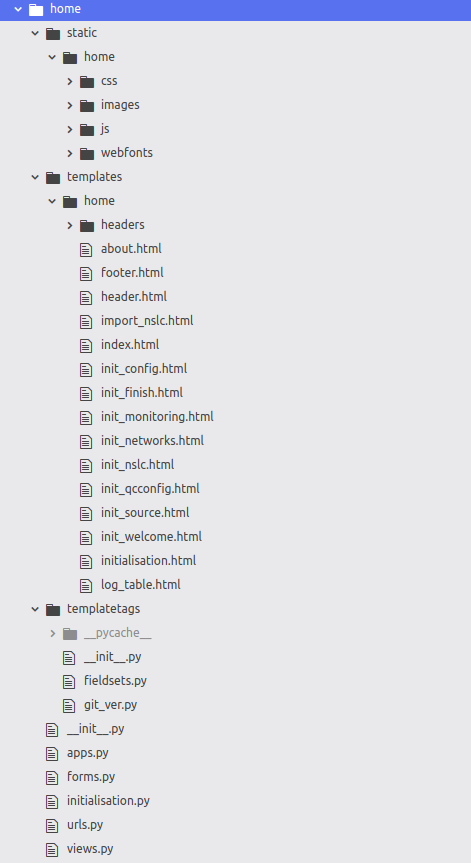

# Morumotto, developer's guide

1. [Plugins](#Plugins)
   1. [Sources](#Sources)
   2. [Data Format](#Data format)
   3. [Metadata Format](#Metadata Format)
   4. [Data Structure](#Data Structure)
2. [Frameworks](#Frameworks)
   1. [Django](#Django)
   2. [Celery](#Celery)
3. [Code Structure](#Code Structure)
4. [Algorithms](#Algorithms)
5. [Debug](#Debug)
6. [Todo](#Todo)


## Plugins

### Sources

Sources plugins are divided in 3 parts :

- Data script (that we are going to name *new_script.sh* in this document)
- Data availability script (*new_script_avail.sh* for this document)
- python class instance (*NewScript* class for this document)

*Note: I'm going to show you how to develop your script with a script written in shell, but you could actually develop it in any language, as long as it respects the Inputs/Outputs we are going to define*

The data script & data availability script must be saved into the plugins/sources/ directory. 

The class instantiation will be written in the plugins/sources.py script

We are going to check the FDSN Web Service plugin to see how to build a new plugin.

#### Data Script

Let's have a look at the *fdsnws.sh* script to see how the script is structured

##### I/O 

Inputs and outputs must always be the same :


If you want to test your script outside of Morumotto, you can call it with the following arguments (for example)

```sh
bash new_script.sh --postfile="PATH/TO/YOUR_POSTFILE" --WORKSPACE="/DIR/TO/TEMP_DATA" --data_format="miniSEED" --blocksize="512" --compression="STEIM2" --cpu_limit=20 --connect_infos="some_info:to?fetch=your_data&using=infos" --log_level=3
```

###### Note on POSTFILES :

Postfiles format is the same as the one used for FDSN Web services requests online. So they look like this :


It is a blank space separated table with the following contents :

*Network Station Location Channel Starttime Endtime* 

It supports wildcards ( * or ? ) in the NSLC description, and dates must be yyyy-mm-ddTHH:MM:SS 

##### IS_ONLINE

Your script must include the following behavior : if it is called with the --is_online=CLIENT argument, it will only check if the resource can be reached (with a *ping* for an online source). This argument cancels all other arguments.  Let's see how fdsnws.sh handles that :


Line 160 : we define a function *is_source_online* that will call the client and return its online status, then exit

Line 178 : we declare is_online as a possible argument for the script

Line 200 : if --is_online is found in the arguments with getopt (line 190), we set an ONLINE_FLAG to true and get the value of the second argument, that we save into the $CLIENT variable

Line 229 : as the $ONLINE_FLAG is true, we call the *is_source_online* with $CLIENT as an argument


##### Checking requirements

It's better to have a requirements double check before we start, for example we need *msi, dataselect, qmerge & cpulimit* to make the fdsnws.sh script work, so we call the *check_requirements.sh* script that does those verifications on line 44. 

Once can also notive on lines 40 to 43 that we export the morumotto/bin directory to the $PATH in order to call those functions : 


##### Checking arguments

We need to check that we have the correct number of arguments when we call our script, which must be smaller than 8 (see I/O) : 


then we get their values using the getopt command :


We then make some defaults (for testing, but not useful when used in morumotto), and exit if postfile and connect infos are not given :


##### Parse connection infos

Then we need to parse the connect-info parameter into the several informations we need to request data from our source. In our case, the parameter will be in the form "client:name.of.client&limit-rate=0k" so we do :


Here we are : we splited the $CONNECT_INFOS into $CLIENT (which gets the value after "client:" in the connect-infos argument) and $LIMIT_RATE (which gets the value after "&limit-rate=" in the connect-infos argument)


##### Fetch data

This is where we write how to get data from the source, in our case a simple wget is done :

 


##### Correct data

Once data has been fetch, we need to check its sample rate, blocksize and then converts it into a single file with the following name format : "NET.STA.LOC.CHAN". For seed data, we already developed a script that does all of that : have a look at plugins/sources/correct_seed.sh. Important part is here :


That's it, all done, your data is saved into a file called  morumotto/WORKING_DIR/PATCH/N_tmpnum/SOURCENAME/N.S.L.C

#### Data availability

The second script we need is just going to check for inventory, in order to ask the source if data is available or not for a given period of time. It works similarly to the above script but instead of fetching data, it just asks for availability. Postfiles are the same format as for the 

So the only part that changes is the [fetch data](#Fetch data) part, which now looks like :

 

We have created a new script for availability, for readability. If availability does not exist for your plugin, it's useless to write such a script.

#### Python class instance

We assume that you have written your scripts and tested them, you can now write the corresponding classes in the *plugins/sources.py* file.

It's pretty simple, as your class is inheriting of a _SourcePlugin_ abstract class. It will just require from you to define 3 arguments and 1 method. Let's have a look :


```python
plugin_file = "your_script.sh"
avail_plugin_file = "your_availability_script.sh"
template = "this is some help text to be displayed in the interface"

def set_connect_infos(self,parameters,limit_rate):
    return "client:%s?limit-rate=%sk" % (parameters,limit_rate)
```

_plugin_file_ and _avail_plugin_file_ are the names of your scripts. It MUST NOT BE ABSOLUTE PATHS. Just give their names, morumotto will automatically concatenate them with the _morumotto/plugins/sources/_ directory.

_template_ is a help text, to help user write the _parameters_ string in the web interface. For example, if your parameters must be something like "/data-sc3/rt_archive&SDS", in template you will write something like "/path/to/data&DataStructure"

Then you need to write a method that will parse the "parameters" string into a line that your plugin will understand, and add the _limit_rate_ to it. Let's say your parameters is _ip_adress=some_ip&port=some_port&timeout=60_minutes_ 

This method will be like 

```python 
def set_connect_infos(self,parameters,limit_rate):
    arg_list = parameters.split("&")
    ip = arg_list[0].split("=")[1]
    port = arg_list[1].split("=")[1]
    timeout = arg_list[2].split("=")[1]
    return "ip_adress=%s&port=%s&timeout=%s ?limit-rate=%sk" % (ip, port, timeout, 	                  limit_rate)
```


(This is not a very nice code, but it's to make it easy to understand, I hope)

Ok you are done, your plugin is now ready ! See in user documentation how to use it.


### Data Format

If you need to use a new data format, it must be implemented in the _plugins/format.py_ file. 

It also requires a script that will perform the algorithm to create a PATCH that will be merged into the final archive. This script **MUST** be saved into the plugins/set_patch directory.  The algorithm for patch creation is the following : 


Your new data format must be a child from the DataFormat() class. Please check this file to see how to implement your new data format.

Be sure not to forget to create the script_path attribute at the beginning of your class, with the name of the script (again, Morumotto will complete automatically the path with the _morumotto/plugins/set_patch_ directory) : it looks like this 


### Metadata Format

In order to create a new metadata format, open the file _plugins/metadata_format.py_ and add a new class that will inherits from the MetadataFormat() class, then you will have to implement correctly the abstract methods. Refer to previous format to see how to proceed.  

### Data Structure

__Important note__ : this is just for you final archive. It is not for your sources. Implement a new structure only if you need your output (final archive) to be in an other structure type than "SDS".


In order to create a new data structure, open the file _plugins/structure.py_ and add a new class that inherits from the AbstractStructure() class, then implement the abstract methods. 


## Frameworks & Libraries


### Django

Version used in Morumotto (so far) is **2.1**

#### Tutorial

Most of this software is based on the Django software. If you want to change anything to the web interface, database tables or command line interface, I strongly recommend to have a look at the beginners tutorial :

https://docs.djangoproject.com/fr/2.1/intro/tutorial01/ 

If you are too lazy, I'll do a quick sum up :

#### Model-Template-View

For its interface, django is divided into 3 parts, following the MTV (a variation of Model-view-controller) schema : 

##### Model

In all applications (in our case : "home", "qualitycontrol", "archive", "logdb" and plugins) you will find a models.py file, which contains all objects that the ORM will link to the database. 

Should anyone change one class in those files, in order to apply changes into the database, it will have to execute the following command (in the mormumotto environment) : 

```sh
python manage.py makemigrations name_of_the_appw_here_you_made_some_changes
python manage.py migrate
```

If it fails, go here : 

https://micropyramid.com/blog/how-to-create-initial-django-migrations-for-existing-schema/

##### Template

All html files are saved in the application/templates directories. In those files, we can use the Django templates, that you can check here :

https://docs.djangoproject.com/en/2.1/topics/templates/ 

##### View 

In each app, there is a view.py and a urls.py files. All backend is done here. I don't have time to explain this in more details, moreover it can be easily understood by doing the first steps of the Django tutorial.  


#### Django plugins

Morumotto uses some plugins from django, which are : 

- [celery_progress](#https://github.com/czue/celery-progress)
- [django_celery_results](#https://django-celery-results.readthedocs.io/en/latest/)
- [bootstrap_datepicker_plus](#https://pypi.org/project/django-bootstrap-datepicker-plus/)
- [bootstrap4](#https://pypi.org/project/django-bootstrap4/)
- [tempus_dominus](#https://pypi.org/project/django-tempus-dominus/)
- [bootstrap_modal_forms](#https://pypi.org/project/django-bootstrap-modal-forms/)
- [betterforms](#https://django-betterforms.readthedocs.io/en/latest/)
- [reset_migrations](#https://github.com/valdergallo/django-reset-migrations)
- [admin_reorder](#https://pypi.org/project/django-modeladmin-reorder/)
- [leaflet](#https://github.com/makinacorpus/django-leaflet)
- [admincolors](#https://pypi.org/project/django-admin-colors/)
- [export](#https://django-import-export.readthedocs.io/en/latest/)

They are used for some pages rendering (bootstrap_datepicker_plus is used in the _new_request.html_ page to render the small calendars to select a date for example). If you go through the code, you will see where all of them are used.

celery_progress & django_celery_results are used to render the progress bars

bootstrap_datepicker_plus and tempus_dominus for date selection

bootstrap4 and bootstrap_modal_forms to make some bridge between bootstrap & django (visit https://getbootstrap.com/docs/4.0/layout/overview/ )

betterforms, admin_reorder, admincolors are used to customise the administration interface and some forms (see https://docs.djangoproject.com/fr/2.1/topics/forms/)

Leaflet is used on the quality control view to display station location

export is used in the administration interface to export some objects in a custom format

Read their respective documentation to have further informations

#### Django Settings 

All settings are found in the _morumotto/settings.py_, also your database settings are in the _morumotto/custom_settings.py_ file 

It contains the LEAFLET plugin settings, CELERY settings, ADMINISTRATION PAGE settings and DATABASE LOGGER settings

### Celery

Celery handles background tasks, please visit :

https://docs.celeryproject.org/en/latest/getting-started/first-steps-with-celery.html

It is used in this project to perform background task, handles the progress bars, and it can be used in future developments to handle multitask (see [Todo](#TODO) list)

### Javascript, Jquery etc.

Morumotto relies on several javascript libraries, like jquery, moment, datatables, cal-heatmap, etc.

Using node.js or any npm is using a lot of space, as our needs are small, we chose to download locally just the few files we need (and save them into the _morumotto/home/static/home/js_ & _morumotto/home/static/home/css_ directories). 

_Note_ : We chose to store all frontend dependencies (like _style.css_ for example) in the _morumotto/home/static/home_ directory so that it will be easy for us to include these files anywhere in the project using Django template language. In fact, the __ template can be used anywhere, so we can access any files in any static directories (for instance our frontend dependencies). If this is a little unclear, see : https://docs.djangoproject.com/en/2.1/howto/static-files/

These files are then called in the _morumotto/home/templates/home/headers/_ .html files, and then those files are called in the actual page _.html_ file. 

For example, to display the heatmap calendar, we need the cal-heatmap javascript library. It is stored here : 

_morumotto/home/static/home/js/cal-heatmap.min.js_

In the _morumotto/home/templates/home/headers/calendar.html_ your can see we call this file on line 10 and 11.

Other dependencies like the _style.css_, _bootstrap_ and _jquery_ amongst others, are called here as well.


The in the _morumotto/monitoring/templates/monitoring/net_gaps.html_ file, which is were the heatmap calendar is used to display statistics of the final archive, we can see on line 6 that we include this script into the html file, which will load the scripts when loading the page.


## Code Structure


As we are using Django, the code has been splited into differents applications. Each app has its own purpose, but you can find some objects from one app in another (like NSLC objects for example).

I will describe each app functioning and models so that one can understand what it is all about.

### Archive

Archive application main purpose is to update a final archive given a pool of different sources.

The files for this application are : 


management/ directory contains all commands for the Command Line Interface

migrations/ directory contains informations for the database updates. It is created and handled by Django (when you do makemigrations and migrate). 

templates/archive/ directory contains the 3 pages for the web interface were the user can interact with this application (view stack, configure automatic update and create a new request. See "User Docs" for more details). progress_stack and progress_update are used by celery to display the progress bar, no need to do anything here

_admin.py_ overrides the default admin page for this app, for example by choosing what to display in the admin interface. It requires some knowledge with the Django framework to understand what's happening there (but its not very difficult to get there : https://docs.djangoproject.com/en/3.0/intro/tutorial02/#make-the-poll-app-modifiable-in-the-admin )

_apps.py_ is a Django file, nothing interesting here

_forms.py_ contains the forms that we use in the _update.html_ & _new_request.html_ pages

_models.py_ is where we have defined the objects that are used by the app. Have a look there, you will find things such as NSLC, CONFIGURATION, REQUEST, GAP, GAPLIST etc. These are the fields that are stored in TABLES in your DATABASE.  

Check this file to see how they are implemented

_stack.py_ This is were morumotto creates requests from the gap list and source availability, and executes stack

_update.py_ This is were morumotto performs the automatic update of data

_urls.py_ is a Django file, used for the backend link between urls and views methods.

_views.py_ is the Django view file for the backend.


Algorithms to update data is described [here][#Data Update]


### Monitoring


Same as above for most of common files, moreover : in _templatetags/_ one can find some methods that are used with Django templates, in order to convert dots into underscores in _href_ tags for example.

For example : we need to convert PF.RER.00.HHZ into PF_RER_00_HHZ in _gaps.html_. If you check the _templatetags/pt2underscore.py_ it looks like this 


Then in _gaps.html_ we import this function into the django template system : 


then we use it here (same gile _gaps.html_)


_models_ contains all class that handles objects related to the monitoring app, which are all objects linked to the monitoring views. (like _ArchiveMonitoring Stat, AverageStat_ ...) 

_update_monitoring_ contains all methods that are used to compute statistics on dataset

Algorithms [here](#Statistics)

### Quality Control


Same as above, 

_qc_ contains all methods that performs the data & metadata quality control

_scripts/_ contains previous scripts to perform qc on datalessSeed, but it is obsolete at the moment.

### Plugins


#### Patch data


### Home




#### Initialisation


#### Static files


#### Header & Footer


### Admin Templates


## Algorithms 

### Data Update

gaps overlaps

request


### Statistics

average


## Debug, Development


#### Log


#### 

Log files are saved into the database.


#### Development

If you want to see what's happening in the background of the software, of if you are willing to develop anything new, you will need to have access to the command informations. 

To do so, first step is to stop supervisor tasks. Open a terminal and do:

```sh
sudo supervisorctl stop morumotto:morumotto_flower
sudo supervisorctl stop morumotto:morumotto_celery
sudo supervisorctl stop morumotto:morumotto_runserver
```

Then open Terminator and split it in two parts. 

In the 1st part, go to your morumotto root dir and then run : 

```sh
source morumotto-env/bin/activate
python manage.py runserver 8000
```


And in the other terminal : 

```sh
source morumotto-env/bin/activate
celery -A morumotto worker -l info
```


You should see something like this 


On your right, you will see celery command. It if fails, kill all celery instances, then run it again. Be aware that any changes made to the _morumotto/tasks.py_ __will not enter into effect if you didn't stop and restart celery__ ! (and this is very important to know). If you use the _print()_ method in a method called by _tasks.py_ (or even in _tasks.py_ itself, you will see the output here)

On your left, you will see the command for Django execution. If you use the _print()_ method in a _views.py_ file, you will see its output here.

Now I recommand to use Atom to develop new things, as this IDE is perfect for what we need to do.


You have the project's tree on the left, some python & shell correction and autocompletion plugins (you can custom Atom plugin very easily), a git/github interface on the right.


## TODO

- Celery multitasking bug for excute stack :

While trying to make celery handle the stack in parallel threads, I stumped upon a bug I couldn't fix. Right now, stack is processed in as a synchronous task. In _morumotto/tasks.py_ we have : 


One can see that we execute request after request. What I tried is to split requests into chunks of _n_ requests (_n_ being defined in the Configuration object), the I'm joining the execution of those requests into groups, then execute the groups : 


but somehow, when executing, the celery worker will disconnect, leaving most of the requests not being processed until I start again the worker (using the Celery command 

 ```sh
celery -A morumotto worker -l info
 ```

)

If you have any idea how to solve this problem, please do so ! 

I remind that we defined the stack execution as being able to process a certain number of requests parallely, e.g. the number define in the configuration object as _n_requests_


- Quality control

What's missing at the moment :


- Testing 

Now it's a Beta release candidate version, we need to install and test Morumotto on actual networks !