# SiQaCo, user guide

_Download PDF Version : [user_guide.pdf](https://k2.ipgp.fr/geber/siqaco/raw/master/docs/user_guide.pdf?inline=false)_

1. [Installation](#Installation )
2. [Initialisation](#Initialisation )
   1. [User friendly initialisation](#1. User friendly initialisation)
       1. [Network](#1. Network initialisation)
      2. [NSLC](#2. NSLC initialisation)
      3. [Source](#3. Source initialisation)
      4. [Update](#4. Update configuration)
      5. [Monitoring](#5. Monitoring configuration)
      6. [Quality Control](#6. Quality Control configuration)
   2. [Admin initialisation](#2. Admin interface initialisation)
   3. [Command line initialisation](#3. Command line initialisation)
3. [Users](#Users )
4. [Basic commands](#Basic commands)
   1. [Built-in commands](#1. Built-in commands)
   2. [Software commands](#2. Software commands)
   3. [Database dump](#3. Database dump)
5. [Functionalities](#Functionalities )
   1. [Home page](#1. Home page)
   2. [Monitoring](#2. Monitoring)
   3. [Stack](#3. Stack)
   4. [Quality Control](#4. Quality Control)
   5. [Celery](#5. Celery)
   6. [Crontab](#6. Crontab)
   7. [Admin](#7. Admin)
6. [New plugins](#New plugins)
7. [Troubleshoot](#Troubleshoot )


## Installation

##### Get source code

```sh
git clone https://k2.ipgp.fr/geber/siqaco
cd siqaco
```

##### METHOD 1 : With Installer

```sh
./install.sh
```


##### METHOD 2 : Manually


For the following steps, you must stay in this folder


##### Dependencies

1. Before starting, make sure you have the following packages installed :

    - python
    - python-pip
    - mysql-server OR mariadb-dev libmariadb-dev-compat (depending on your linux distribution)
    - wget
    - libmysqlclient-dev OR libmariadb-dev (depending on your linux distribution)
    - wget
    - libpython3.6-dev
    - supervisor


    In Ubuntu:  
    
    ```sh
    sudo apt-get install -y python wget make python-pip mysql-server libmysqlclient-dev python3-dev libpython3.6-dev python3-venv supervisor
    ```
    
    In Debian:
    ```sh
    sudo apt-get install -y python wget make python-pip mariadb-dev libmariadb-dev-compat libmariadb-dev python3-dev libpython3.6-dev python3-venv supervisor
    ```


2. Install dataselect (version >= 3.20 ) in /siqaco/bin : ([Visit the IRIS GitHub page to install](https://github.com/iris-edu/dataselect "github.com/iris-edu/dataselect"))


3. Install qmerge in /siqaco/bin : ([Download tar file here](http://www.ncedc.org/qug/software/ucb/qmerge.2014.329.tar.gz "ncedc.org/qug/software/ucb/qmerge.2014.329.tar.gz")). Then copy the qmerge executable to /siqaco/bin.

4. Install msi in /siqaco/bin : ([Visit the IRIS GitHub page to install](https://github.com/iris-edu/msi "github.com/iris-edu/msi"))

5. Install sdrsplit in /siqaco/bin : ([Download tar file here](http://www.ncedc.org/qug/software/ucb/sdrsplit.2013.260.tar.gz)) Then copy the sdrsplit executable to /siqaco/bin.


6. Install RabbitMQ (The parallel task are handled by the task queue manager [Celery](http://docs.celeryproject.org/en/latest/getting-started/first-steps-with-celery.html#first-steps "First steps with celery").
Celery requires to install a broker, SiQaCo uses RabbitMQ)  

    In Ubuntu/Debian :    

    ```sh
    sudo apt-get install rabbitmq-server
    ```


##### Initialise the environment

1. You must know your system python version. For that, in a terminal window, type:  

    ```sh
    python --version
    ```

2. Create the virtual environment (inside the _siqaco_ root directory)

    - If your python is < 3.3 :  

        ```sh
        virtualenv siqaco-env -p python3.6
        ```

    - If your python is >= 3.4 :  

        ```sh
        python3 -m venv siqaco-env
        ```

3. Install requirements :  

    ```sh
    source siqaco-env/bin/activate  
    pip install numpy # needs to be installed first, doesn't work within requirements
    pip install -r requirements.txt
    ```

##### Initialise LEAPSECONDS

  - Check if you have already initialised the leapsecond var in your shell :

    ```sh
    echo $LEAPSECONDS
    ```

  - If prompt returns an empty string, you may use the leapsecond list provided here ()

    ```sh
    echo "export LEAPSECONDS='${HOME}/siqaco/leapsecond.list'" >> ${HOME}/.bashrc
    ```

    - Be sure to add new leap seconds to your LEAPSECONDS file when they are issued ! To update the leapsecond file : go to http://www.ncedc.org/ftp/pub/programs/leapseconds


##### Initialise your MySQL database

Now, you will have to create a SiQaCo database within MySQL. To do so:

+ connect to MySQL as root:  

    ```sh
    mysql -u root -p
    ```

+ enter root password
+ in the _mysql_ prompt, type:


    ```sql
    CREATE DATABASE SIQACO;
    CREATE USER 'siqaco_user'@'localhost' IDENTIFIED BY 'your_password';
    GRANT ALL ON SIQACO.* TO 'siqaco_user'@'localhost';
    FLUSH PRIVILEGES;
    ```

Then add to your custom settings (siqaco/siqaco/custom_settings.py) :

```python
DATABASE_ENGINE = 'django.db.backends.mysql'
DATABASE_NAME = 'SIQACO'
DATABASE_USER_NAME = 'siqaco_user'
DATABASE_PASSWORD = 'your_password'
DATABASE_HOST = 'your_host' #defaults to 127.0.0.1 to use local database
```

There is a template in the siqaco/siqaco folder. Just duplicate it and remove the .template at the end of the file name and put your own settings in it. For the Allowed hosts, see below ("Access from another computer in the same network")


_Note: you can change the database, user and password at your convinience, but they must be the same in the database and in the custom settings file_

If you want to use another RDBMS (PostGreSQL for example), please check the [Django documentation](https://docs.djangoproject.com/en/dev/topics/install/#database-installation "Django Database Installation")


##### Bind database tables to SiQaCo objects

+ Inside the _siqaco_ root directory, execute

    ```sh
    python manage.py migrate  
    python manage.py makemigrations seismicarchive monitoring qualitycontrol logdb
    python manage.py migrate
    ```


##### Create an admin user :

+ Inside the _siqaco_ directory, execute

    ```sh
    python manage.py createsuperuser
    ```

Fill the required informations. Don't forget it, it will be your administrator user for the SIQACO software

All good, you're ready to go now !


##### Deamonize it :
  + Automatically :

In a terminal, paste the following code (or run is in a script) :

```sh
dir=$(pwd)
cat <<EOT >> morumotto.conf
[program:morumotto_celery]
command = ${dir}/siqaco-env/bin/celery -A siqaco worker -l info
user = ${USER}
directory = ${dir}
logfile = /var/log/supervisor/morumotto_celery.log
logfile_maxbytes = 50MB
logfile_backups=10
loglevel = info
autostart = true
autorestart = true

[program:morumotto_flower]
command = ${dir}/siqaco-env/bin/celery flower -A siqaco --address=127.0.0.1 --port=5555
user = ${USER}
directory = ${dir}
logfile = /var/log/supervisor/morumotto_flower.log
logfile_maxbytes = 50MB
logfile_backups=10
loglevel = info
autostart = true
autorestart = true

[program:morumotto_runserver]
command = ${dir}/siqaco-env/bin/python manage.py runserver 0.0.0.0:8000
user = ${USER}
directory = ${dir}
logfile = /var/log/supervisor/morumotto_runserver.log
logfile_maxbytes = 50MB
logfile_backups=10
loglevel = info
autostart = true
autorestart = true

[group:morumotto]
programs=morumotto_celery,morumotto_flower,morumotto_runserver
priority=999

EOT
sudo mv morumotto.conf /etc/supervisor/conf.d/ || exit
sudo supervisorctl reread
sudo supervisorctl update
```


  + Manually :

Create a file named morumotto.conf, and paste the following text inside :


**WARNING : you must change ${dir} with your siqaco directory and ${USER} with your user name**

_morumotto.conf_
```sh
[program:morumotto_celery]
command = ${dir}/siqaco-env/bin/celery -A siqaco worker -l info
user = ${USER}
directory = ${dir}
logfile = /var/log/supervisor/morumotto_celery.log
logfile_maxbytes = 50MB
logfile_backups=10
loglevel = info
autostart = true
autorestart = true

[program:morumotto_flower]
command = ${dir}/siqaco-env/bin/celery flower -A siqaco --address=127.0.0.1 --port=5555
user = ${USER}
directory = ${dir}
logfile = /var/log/supervisor/morumotto_flower.log
logfile_maxbytes = 50MB
logfile_backups=10
loglevel = info
autostart = true
autorestart = true

[program:morumotto_runserver]
command = ${dir}/siqaco-env/bin/python manage.py runserver 0.0.0.0:8000
user = ${USER}
directory = ${dir}
logfile = /var/log/supervisor/morumotto_runserver.log
logfile_maxbytes = 50MB
logfile_backups=10
loglevel = info
autostart = true
autorestart = true

[group:morumotto]
programs=morumotto_celery,morumotto_flower,morumotto_runserver
priority=999
```

</details>

Then move it to the /etc/supervisor/conf.d, and update supervisor

```sh
sudo cp morumotto.conf /etc/supervisor/conf.d/morumotto.conf
sudo supervisorctl reread
sudo supervisorctl update
```


## Initialisation

You can initialise the software either manually in the admin interface, via command line _(but not yet)_ or using the web interface.

### 1. User friendly initialisation

After installation, open a terminal, navigate to your siqaco directory and execute :

```sh
>$ source /siqaco-env/bin/activate
>$ python manage.py runserver
```

Then in a browser go to [localhost:8000/home](127.0.0.1:8000/home)

You will be prompt to login :

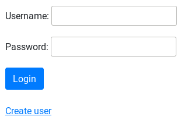

I you didn't create an administrator yet, please do so ! See [Create an admin user](#Create an admin user :).

Login with your administrator user

The first time you run the software, you shall see the following window popping up :

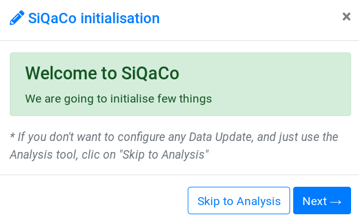


If you don't see this window,  clean your database _(i.e. delete all objects in the [admin interface](#6. Admin)) and go back to [/home](127.0.0.1:8000/home)

The button will bring you straight to the [Monitoring configuration](#5. Monitoring configuration). *It can be useful if you don't want to update any data but just have some statistics of a given archive*


Now, let's do the initialisation step by step :


#### 1. Network initialisation

You shall see this window now :

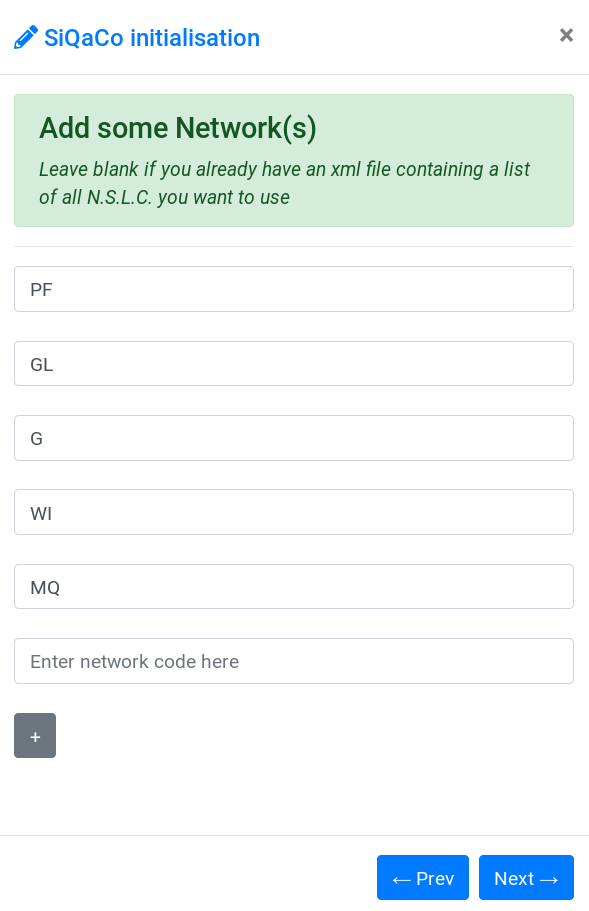


You can add several Networks codes here (like in the example), to add more lines use the  button.

If you already have an xml file containing all N.S.L.C. (Network Station Location Channel) that you are going to use, you can skip this page and just click on . More details about XML files in [section 2 below](#2. NSLC Initialisation).


#### 2. NSLC Initialisation

You shall now see this window :

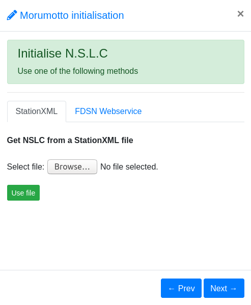

**IF** you have entered some Network codes on the [previous](#1. Network initialisation) page, you can now use a Webservice that will automatically find and save all N.S.L.C. available for this network on the given Client. This is using the [obspy library](https://docs.obspy.org/packages/obspy.clients.fdsn.html), and only works if you are online. This may find some N.S.L.C. that you don't want to use, you will be able to [delete them by hand later](#Delete NSLC)

**Otherwise**, you can select an file containing all N.S.L.C. that you wish to use. In this file, NSLC must be | separated, like in the following example :

#Network | Station | Location | Channel
G|AIS|00|BHE
G|AIS|00|BHE
G|AIS|00|BHE
G|AIS|00|BHE

**Either way**, don't forget to validate the input by clicking on  or 

#### 3. Source initialisation

You shall now see the following window :

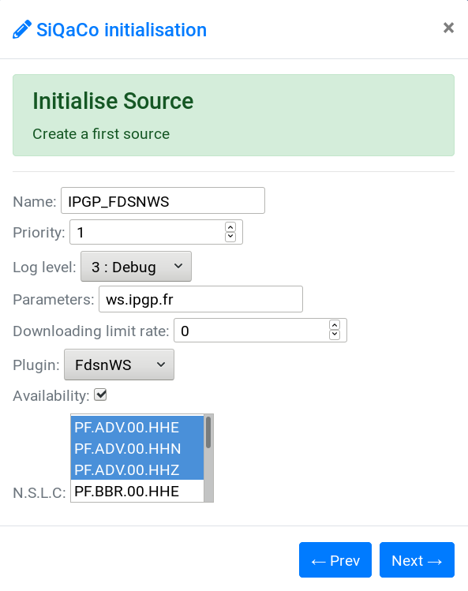

This is the first source that you will interrogate to fetch data and construct your final archive. **Please read the [source paragraph](#3. Stack) to see how to create your source.**

For now, let's say we want to use the IPGP FDSN Webservice to get data, so we need to enter client's name in the parameters (according to this source's definition), and then you can change some stuff like if we want the plugin to be more or less verbose (debug is the maximum verbosity), if we want to limit the downloading rate, which NSLC we want this source to be linked to, and choose if you want to build an inventory for data availability on the source (selected) of not (unselected).


#### 4. Update configuration

You will now see this window :

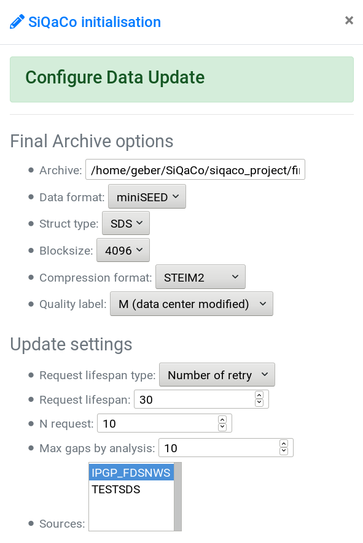

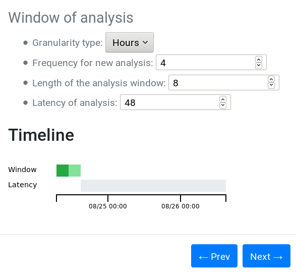


First, let's configure the output :

- Give the full path to the final archive (this is where the downloaded data will go)
- Select the output format for the data, the structure type, block size, compression format and quality label

Change the update setups :

- Choose if you want the software to retry requests for a period or over a number of times
- Choose the period duration (in hours) OR the number of times
- Choose the number of requests to be processed at the same time ( = number of multithreads)
- Choose a threshold over which we concatenate gaps into a single big gap going from the starting of the first gap to the end of the last gap
- Choose which sources you will interogate

Configure the window of analysis

- By changing parameters, you will see the timeline changing. Grey area represents the latency, meaning that the data won't be donwloaded, only the green period will be downloaded. In normal functioning, dark green represents the period where data should already be in the final archive but we still continue to ask sources for new data (if any gap found), and light green represents period over which we don't have any data yet.
- You can hover on the timeline to have details of the selected window


#### 5. Monitoring configuration

You shall now see this window :

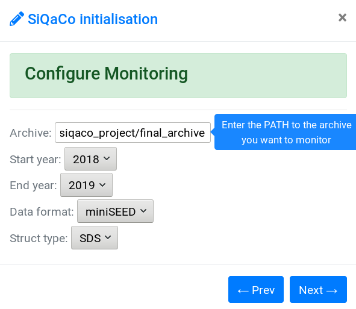

- Give the full path to the archive you wish to monitor. If you have done steps 1. to 4., it will already be defined as the path to your final archive. You can change it but it's **nonsense**. If you came directly here with the  button, you can now choose the path to the archive you wish to monitor.
- Give the year to start the analysis and the year to end it. You can change this later.
- Give the Data format and the data structure of your archive (they should match your update configuration values, instead, again, it's nonsense)

#### 6. Quality Control configuration

You shall now see this window :

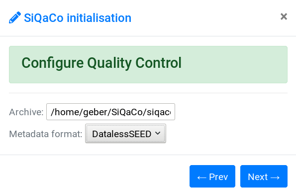

- Choose the path where you have you data and metadata
- Choose the metadata format

Now logout from your admin session (top right menu) : 

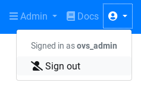

And you are done.


### 2. Admin interface initialisation

This is kind of fastidious... _Coming soon though._


### 3. Command line initialisation

See below [Initialise software](#2. Software commands)


## Users

The software comes with 3 levels of use : basic, advanced and admin. 

##### Basic user

The basic user is the default one, it doesn't require any login. It can access all pages that don't modify data : Quality Control, Monitoring & Stack View. Other pages are grayed out in the top menu :

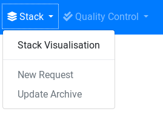

##### Advanced user

The advanced user can access to all pages accessible by basic users, plus all the pages that will modify & update data : update monitoring statistics, add new request(s), update archive. It is also able to Start/Stop the crontab for automatic data update on the /home page and delete request on the stack view page.


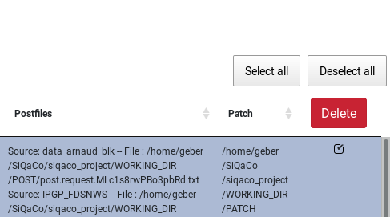


##### Admin

The admin can access all pages and functionalities accessible by advanced users, plus the admin interface,  the logs & the Celery Queue Monitor. 

#### User creation 

First of all, you NEED to have an admin : see [Create an admin user](#Create an admin user :)

Then in the admin interface, you can create new users from the [admin/auth/user/add/](#127.0.0.1:8000/admin/auth/user/add/) page:

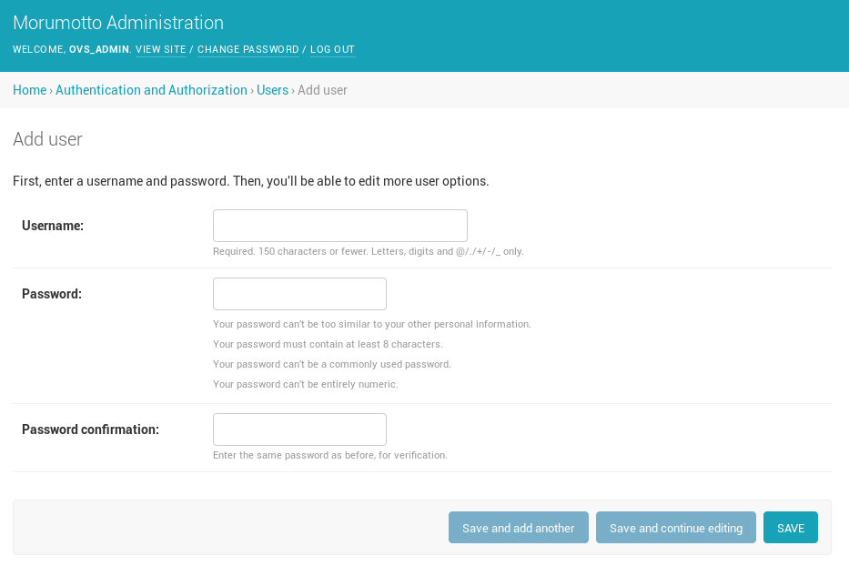


When you save it, you access another page where you can define the roles :

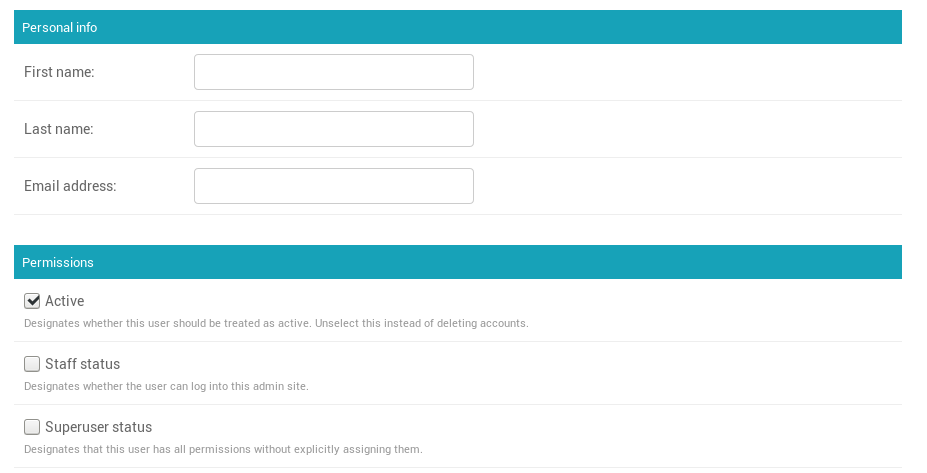

To create another admin, select the superuser status. 


To custom the database objects a user can view/edit, you may use the Staff status and custom the permissions. See [docs.djangoproject.com/fr/2.1/topics/auth/default/#auth-admin](#https://docs.djangoproject.com/fr/2.1/topics/auth/default/#auth-admin)


#### Reset Password

You can reset password from the login page : 

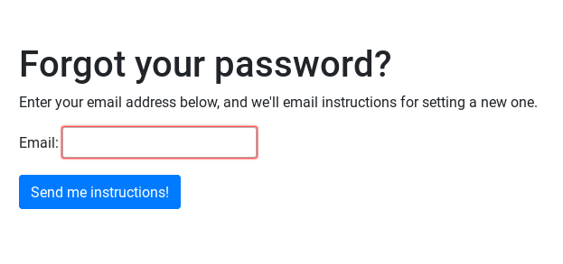

__IMPORTANT__ : This is working only for user who have set there emails

_Note_ : As is, the software will not send any emails. Please check the _siqaco/settings.py_ file to see how to configure mail. By default, the software will create a _send_mails_ folder and you will find instructions here to change password.

##### You can also set password with the following command line :

```sh
python manage.py changepassword <username>
```


<div style="page-break-after: always;"></div>
## Basic commands

First of all, the software has it's own python environment, which is located inside the *siqaco-env/* directory.

You need to **activate** this environment before doing anything, otherwise it will not work. To do so, in the *siqaco/* directory, run :

```sh
>$ source siqaco-env/bin/activate
```

To deactivate the environment, you can just run the following command (anywhere) :

```sh
>$ deactivate
```


The software uses the [Django API](https://docs.djangoproject.com/en/2.1/), thus the commands we are going to use are based on the Django command management system.

Let's review the built-in useful commands then the commands to run the software.

#### 1. Built-in commands

- Run server

  Run this command to initialize the web server :

  ```sh
  >$ python manage.py runserver
  ```

  This is the most basic way to initialize the server, you can now connect to the interface here : [127.0.0.1/8000](127.0.0.1:8000) (which automatically redirects to the /home page)

  You can also specify the port you want to use and if you want to be  able to access the interface from another computer in your network (*), you must define the broadcast address 0.0.0.0, like this :

  ```sh
  >$ python manage.py runserver 0.0.0.0:8080
  ```

  You can now access the software web interface from any computer in your network with the following URL : 1.2.3.4:8080 (with 1.2.3.4 being the IP address of the server where you have installed the software)

  More infos [in the django documentation](https://docs.djangoproject.com/fr/2.1/ref/django-admin/)

  _(*) Note : to be able to access the software remotely, you need to add the IP address of the server where you installed the software, let's say 1.2.3.4, to the "ALLOWED_HOSTS" in the siqaco/siqaco/settings.py file. It will be something like :_

  _ALLOWED_HOSTS = [ "1.2.3.4", "127.0.0.1", ]_

- Make migrations *(only for dev)*

The software uses the Django ORM to manage database. In case of someone adding a new class to the code, you have to create database instances corresponding to this model after pulling code from gitlab.

```sh
>$ python manage.py makemigrations qualitycontrol seismicarchive monitoring logdb
>$ #then to make these migrations effective :
>$ python manage.py migrate
```

#### 2. Software commands

- Print useful environment variables and directories

```sh
>$ python manage.py print_env
```

It will show where are located the commands used by the software

- Initialize software _(not available yet)_

```sh
>$ python manage.py init_setup config_file siqaco/setup.xml --nslc_file siqaco/nslc.list --source_file siqaco/sources.xml
```

This command will parse the setup.xml (and optionally nslc.list and sources.xml) into the database. You can custom those file at your convenience.

- Create request

```sh
>$ python manage.py create_request starttime 2018-04-22T06:00:00Z endtime 2018-04-22T07:00:00Z nslc_list PF.PRO.00.HH? PF.RER.90.HHZ --source_list FDSNWS_IPGP LOCAL_DIR_HOME
```

This will create two request : one to fetch data from 6am to 7am on the 22nd April 2018 on station PRO (which has multiplexed channels, so it will ask data to E,N and Z channels in a single request), and another request to fetch data from RER HHZ channel for the same time window. The _--source_list_ argument is optional. The sources must be defined in the database, call them by their names here.

starttime and  endtime must be yyyy-mm-ddTHH:MM:SSZ format.

_This command only creates request(s), it doesn't execute them, as they are pushed to the stack_

- Execute stack

```sh
>$ python manage.py exec_stack
```

This will read the stack and execute all request (in multithreads when available) if they are flaged as "new" or "retry"

- Window update

```sh
>$ python manage.py window_update --window_starttime 2018-04-22T00:00:00Z window_endtime 2018-04-28T00:00:00Z
```

This command will perform the update according to the database configuration. You can choose to force the window but be aware that it you must set both start **and** end time, if you just set one, the default configuration window will be taken into account.

- Clean database

```sh
>$ python manage.py clean_database -i DataFile
```

This command will remove from database all Gap, Overlap, DataFile, SourceAvailability, SourceAvailabilityStat, SourceOnlineStat, Postfile, Request & GapList objects. If you want to keep some objects, just use the -i (or --ignore) flag, _e.g._ if you want to keep all DataFile in the example above.

See documentation to have more details on these objects.

- Update statistics

```sh
>$ python manage.py update_stats -c 1
```

This command will update statistics according to the first monitoring configuration in the database (see [admin](#Admin interface)). You can force another configuration instance by giving it's database ID with the -c (--config_id) flag.

- Clean statistics

```sh
>$ python manage.py clean_stats
```

This command will remove from database all Stat, AverageStat, AverageCompStat, ChanPath, CompPath objects. Like the clean_database command, you can use an -i (--ignore) flag to keep some objects in the database.


#### 3. Database dump

To create a dump file of your database   
```sh
python manage.py dumpdata > db.json
```

To load a dump file  
```
python manage.py loaddata > db.json
```


<div style="page-break-after: always;"></div>
## Funtionalities

### 1. Home page

- View of the latest logs


- Start / stop the Cronjobs button


### 2. Monitoring

- Network

  - Gaps


  - Overlaps


-  Stations

  - Gaps
  - Overlaps
  - Data Availability

- Statistics

  - Table
  - Plot

- Admin
  - Group components in 'others'
  - Change setup

### 3. Stack

- Stack view
- Create new request
- Update Archive
- Admin
  - Change configuration
  - Delete NSLC
  - Station multiplexing
  - Create / delete source
  - Other objects

### 4. Quality Control

- Menu
- Status
- Update Metadata
- Check Metadata
- Stations location
- Plot response files
- Check Metadata versus Data
- Check Data
- Plot Completion
- Admin
  - Configure QC
  - Delete metadata

### 5. Celery

### 6. Crontab


### 7. Admin

- Admin interface
- Delete objects
- Create objects
- Logs


<div style="page-break-after: always;"></div>
## New plugins

### 1. New source

- Class
- Source script


### 2. New _(meta)_data format

- Class
- set_patch script


### 3. New data structure

- Class


<div style="page-break-after: always;"></div>
## Troubleshoot

- If you see the following message while trying to run a command in a terminal :

```sh
File "manage.py", line 14
    ) from exc
         ^
SyntaxError: invalid syntax
```

This means you forgot to activate your environment. Simply run

```sh
>$ source /siqaco-env/bin/activate
```

and run your command again.

- Error while trying to make migrations / migrate

1. Try to reset migrations (for example if the problem hits the qualitycontrol database) :

```sh
>$ python manage.py resetmigrations qualitycontrol
```

2. You can follow the steps described [here](https://micropyramid.com/blog/how-to-create-initial-django-migrations-for-existing-schema/)

> *Step 1:* Empty the django_migrations table:
>
> Just go to your corresponding database terminals and delete all the records from you django_migrations table with
>
>```mysql
>delete from django_migrations;
>```
>
> *Step 2:* Remove all the files in migrations folders in each and every app of your project.
>
> Go to terminal and run remove all files in migrations folder with
>
>```sh
>rm -rf <app>/migrations/
>```
>
> *Step 3:* Reset the migrations for the "built-in" apps:
>
> Reset all the migrations of the Django's built-in apps like admin with the command
>
>```sh
>python manage.py migrate --fake
>```
>
> *Step 4:* Create initial migrations for each and every app:  
>
> **For each app run:**  
>
>  `python manage.py makemigrations <app>.`  
>
> **Note:** Take care of dependencies (models with ForeignKey's should run after their parent model).  
>
> *Step 5:* Final step is to create fake initial migrations:  To create initial fake migrations just run
>
>  `python manage.py migrate --fake-initial`  
>
> With all the above five steps all the initial migrations will be  created for the existing database schema. Now you can use the Django's  migrations system normally. To test if the migrations are succeeded or  not, just add a new field to any of the models and run **python manage.py make migrations** and then it will create a migration file in the corresponding migrations folder of the corresponding app, and then run **python manage.py migrate**. If this succeeds our above steps are the success and you can enjoy the beauty of Django's migrations.
